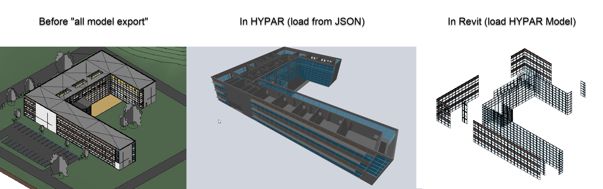

<h1 align="center">
   
  
   
  Hypar Converters
   
</h1>

<h4 align="center">Totally Awesome Hypar Converters.</h4>

  <a href="#repository-information">Repository Information</a> •
  <a href="#how-to-use">How To Use</a> •
   <a href="#known-issues">Known Issues</a> •
  <a href="#contact">Contact</a> 

## Repository Information
This repository houses code for Hypar converters for Revit developmed by Parallax Team.

* [Curtain Wall Conversion](./src/curtainWall) 
  - Code for export to Hypar.
  - Preliminary code for import to Revit with default types.
  - CurtainWall.g.cs extension to [Hypar.Elements library](https://github.com/hypar-io/Elements).
* _others coming soonish?_

## How To Use
* [Install Hypar Revit Plugin](https://github.com/hypar-io/Elements/releases/tag/0.8.1-alpha1-revit)
* [Download Latest Release](https://github.com/ParallaxTeam/HyparElementConverters/releases)
    - download latest release and put in the "Converters" folder.

## Known Issues
- HYPAR to Revit
  - Perimeter mullions are not able to be added at this time. This is due to the Revit API not having methods for this.
  - Mullion types - at this time default rectangular mullions ad circular mullions are supported. We need to add support for corner mullions and mullions with custom profiles.

## Contact
* [ParallaxTeam](http://www.parallaxteam.com/)
  - Custom converter development provided by Parallax Team.
* [HYPAR](https://hypar.io/)
    - awesome people making awesome tools

## Current Results
 